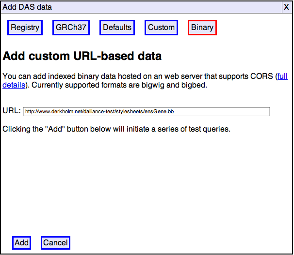

Dalliance can integrate data from certain types of indexed binary file
directly, without any software support beyond that provided by normal
web servers like [Apache HTTPD](http://httpd.apache.org/).  Indexed
binary data can also be viewed directly from disk, with no server
requirements whatsoever.  This is potentially the easiest way to add
your own data to Dalliance.  It may also have performance advantages
over traditional DAS, especially when you have larger numbers of
features or a slow network connection.  There are currently a few
limitations:

1. Binary data suppport only works with the newest web browsers (currently
Google Chrome 8 or later, or Firefox 4.0 or later).

2. Although standard web server software can be used, some reconfiguration
may be needed (see below).

3. Some DAS attributes (*e.g.* web-links associated with features) are not
available using the currently-supported binary formats.

4. The browser security model means that a web application can only
access files that you have explicitly selected using a file-chooser
dialog.  The resulting permission only lasts for the duration of the
current browsing session, therefore there is no way for Dalliance to
automatically restore tracks added from local files when you restart
the browser.

If none of these limitations affect you, indexed binary formats may
well be your best option.

Because these formats have a relatively compact index data structure
associated with the primary data, Dalliance can access the index and
only fetch the required data, even though data covering the whole genome
is combined into a single file.  The great majority of modern web server
software can return arbitrary portions of a requested resource (using
the `Range` header to specify the desired portion).

Preparing binary data
---------------------

Currently supported formats are [bigBed](http://genome.ucsc.edu/goldenPath/help/bigBed.html) and [bigWig](http://genome.ucsc.edu/goldenPath/help/bigWig.html).
These have exactly the same capabilities as the corresponding text-based
BED and WIG formats, and are usually produced by converting and existing
BED or WIG.  Tools to perform this conversion can be downloaded from UCSC.

Other formats (*e.g.* [BAM](http://samtools.sourceforge.net/)) may be
supported in the future.

Configuring your server 
------------

(You can skip this if you are only interested in accessing local files).

In principle, you can just drop a binary file on a web server and access
it from Dalliance.  However, unless you are able to host the file on the
same server as the Dalliance code itself, fetching the data requires
[cross origin requests](/cors.html), and a little server reconfiguration
may be required if such requests are to succeed.  Assuming you're using
the common [Apache HTTPD](http://httpd.apache.org/) web server, the following
configuration should do the trick:

        Header set Access-Control-Allow-Origin "*"
        Header set Access-Control-Allow-Headers "Range"

The first line is the standard header for enabling cross-origin requests.
The second is slightly more subtle: by default, cross-origin requests
are restricted to simple HTTP requests without custom headers.  The extra
CORS header means that Dalliance can initiate requests which use the `Range`
header in order to fetch just a small portion of the data.

The simplest place to put these lines would be in a `.htaccess` file in
the same directory as the binary content you with to view with Dalliance.
If you are lucky, this will work even if you just have a personal directory
on a web server operated by somebody else.  However, some web servers have
been configured to ignore `.htaccess` files, and even those that do may
not be configured to allow custom headers.  If this doesn't work, you
have two options:

1. Ask the server administrator to enable `.htaccess` files and ensure
that custom headers can be configured (briefly, this requires that
`mod_header` be loaded, and that "`AllowOveride FileInfo`" be configured).

2. Place the "`Header set`" directives in the global configuration file
instead.  They can be placed inside a `Directory` section if you do not
wish them to affect the whole server.

Adding binary data tracks
------------

Adding binary data to Dalliance is a very similar process to adding custom
DAS data.  Click the "Add track" button and then select the "Binary" tab.

Enter the URL where your data is hosted, or select a file, then click "Add".

Check the track name and coordinate system, click "Add" again, and you're done.

Hosting binary data
------------

We are currently on the lookout for good places to host binary data which
allow the required CORS headers to be set.  For now, you'll probably need
to configure your own server or ask the IT staff in your organization to
do this for you.